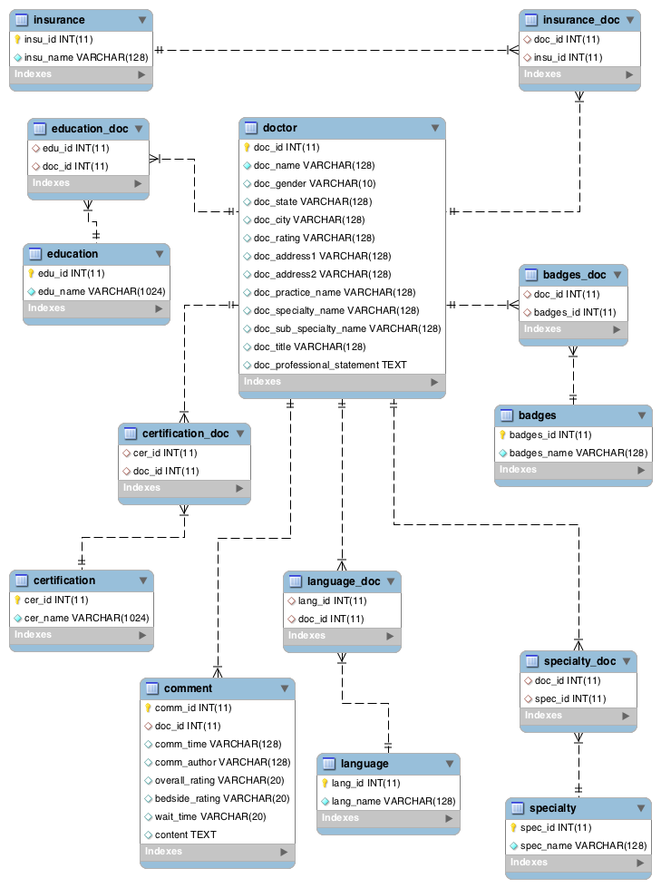

### zocdoc spider

---
## 数据库设计

-   数据库ER图
	 
-	 表的结构以及含义
	-	doctor **医生表，存储医生的基本信息**
		-	doc_id： 医生的id
		- 	doc_name：医生的名字
		-  doc_gender：医生的性别
		-  doc_state：医生所在的州，比如NewYork
		-  doc_city：医生所在的城市，比如Boston
		-  doc_rating：医生的rating，在医生列表里展示的
		-  doc_address1：医生地址1，具体地址
		-  doc_address2：医生地址2,州和城市
		-  doc\_practice\_name：医生名字（详情页），通常与医生姓名相同
		-  doc\_specialty\_name：医生列表里给出的类别
		-  doc\_sub\_specialty\_name：医生详情页给出的子类别
		-	doc_title：医生的title，比如MD
		- 	doc_professional_name：医生自我陈述，在详情页
	-	badges **医生奖杯**
		-	badges_id：奖杯id
		- 	badges_name：奖杯的名字
	- 	badges_doc **存储某个医生有哪些奖杯的表**
		-	badges_id：奖杯的id，来自于badges
		- 	doc_id：医生的id，来自于doctor
	-  certification **Board Certifications**
		-	cer_id 
		- 	cer_name
	-  certification_doc **Board Certifications 与医生联立表**
		-	cer_id
		- 	cer_name
	-  comment **评论表**
		-	comm_id：评论id
		- 	doc_id：对应的医生的id
		-	comm_time：评论的时间
		-	comm_author：评论的作者
		- 	overall_rating：总的打分（0.0-5.0）
		-  	bedside_rating：临床表现（0.0-5.0）
		-   wait_time：等待时间（0.0-5.0）
		-   content：评论内容
	-  education **教育经历**
		-	edu_id：教育经历id
		- 	edu_name：教育经历具体内容
	-  education_doc **存储某个医生有哪些教育经历的表**
		-	edu_id：来自于education的id
		- 	doc_id：来自于doctor的id
	-  insurance **insurance**
		-	insu_id：id
		- 	insu_name：insurance的具体内容
	-  insurance_doc **医生与insurance的联立表**
		-	insu_id：来自于insurance的id
		- 	doc_id：来自于doctor的id
	-  language **存储各种语言的表**
		-	lang_id：语言id
		- 	lang_name：语言具体名字
	-  language_doc**医生与语言联立表**
		-	lang_id：语言id
		- 	doc_id：医生的id
	-  specialty **医生擅长的specialty**
		-	spec_id：specialty的id
		- 	spec_name：specialty的name，比如Primary Care Doctor
	-  specialty_doc **specialty与医生联立表**
		-	spec_id：specialty的id
		- 	doc_id：医生的id
		
##实现思路
-	程序整体架构
	-	get_doctor是最主要的函数，用于根据city与specialty构造的query去获取医生的列表（每次只能获得10个）。
	-	每次获得10个医生之后，开启十个线程抓取这10个医生的信息；
	- 	医生分为两种，一种是激活的、另一种是没有激活的；区别是激活的医生url里面带有医生的id，没有激活的医生url里面不带有id；这两种医生的个人详情页是不一样的，get\_info是获得激活医生的详情页信息的，对于没有激活的，用get\_info\_offline
- 	具体细节
	具体实现细节见代码及注释

